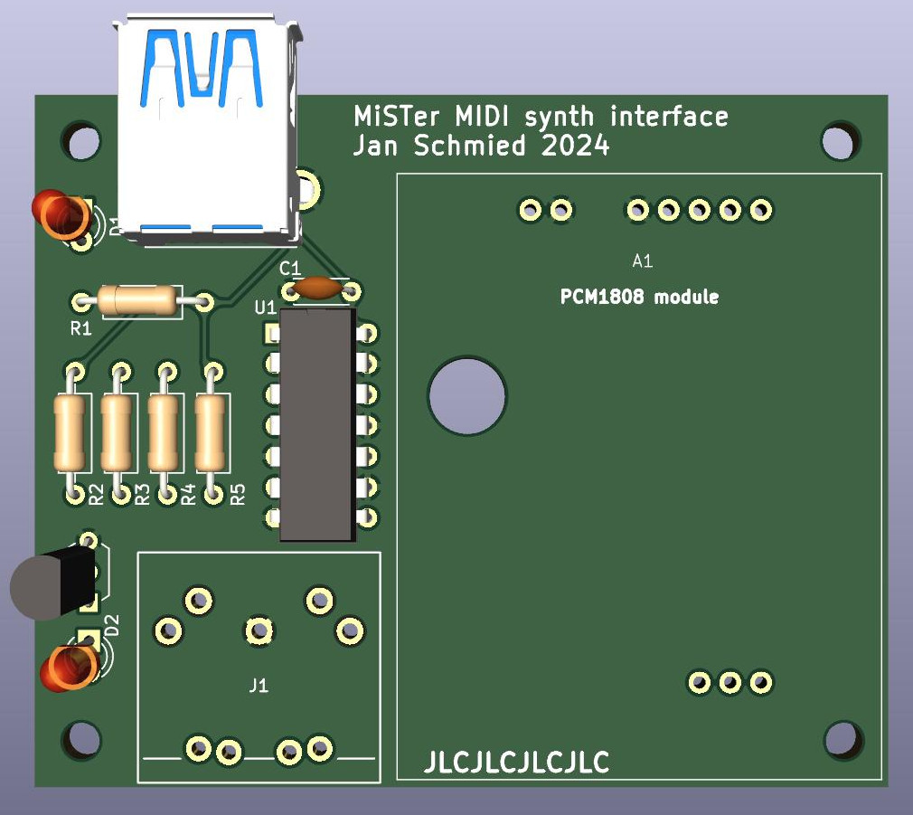

# Mr. MIDI
MIDI interface for MiSTer FPGA with ADC to mix music with SFX and output over HDMI/audio jack. The design aims to DIY assembly and uses only thru-hole parts.

## Principe
Thanks to MT-32pi - MiSTer compatibility, there are MIDI out and I2S signals on the user port on the Analog/Digital IO board. 
MT-32pi gets the MIDI data and produces I2S data, that are mixed with SFX output from the emulated sound card.
To get the same result with a real MIDI synth, we need a line driver to get 3.3V logic of the MiSTer to 5V levels of the MIDI interface 
and ADC with I2S output to digitalize analog audio output from the synth. Connection with MiSTer is though USB 3.0 cable (male-male), the same one as for MT-32pi hat.

## Manufcture
The PCB is optimzied for JLCPCB. Use the gerber files from the latest release. 

## BOM

|Id |Value|Note|
|---|-----|----|
|R1 |180R 0207|For LED D1|
|R2 |180R 0207|For LED D2|
|R3 |4K7 0207 |signal for Q1|
|R4 |220R 0207|MIDI interface|
|R5 |220R 0208|MIDI interface|
|C1 |100nF 5mm|bypass|
|Q1 |BS170_D26Z|for driving LED D2|
|D1 |3mm 20mA 2V|power LED|
|D2 |3mm 20mA 2V|activity LED|
|U1 |SN74HCT14N||
|J1 |CONNFLY DS1095-05-LNR0|USB 3.0 A Female|
|J2 |DIN 5 Female|https://www.mouser.co.uk/ProductDetail/490-SDS-50J, or similar, almost all DIN5-180 connectors have the same footprint|
|A1 |PCM1808|ADC module|

Al is PCM1808 module abvailable on Aliexpres: <https://www.aliexpress.com/item/1005006141604047.html>. 
There is another PCM1808 module, usually purple which is not compatible with this project.
A1 (PCM 1808) can be soldered directly or using female pin headers (1x2, 1x5, 1x3).

## Bootstraping the module
The PCM1808 module needs to be set to master, I2S-24 bits, 48000Hz.
| OP1 | OP2 | OP3 |
|:---:|:---:|:---:|
|open |short|open |

